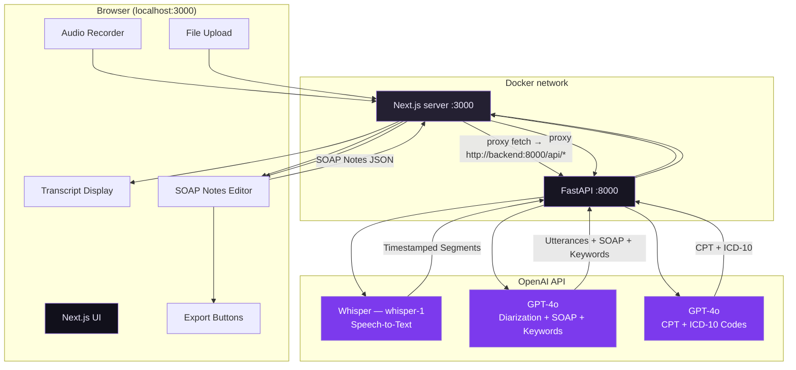

<p align="center">
  
</p>

# MediScript AI — AI-Powered Clinical Documentation

An AI-powered application that converts patient–doctor conversations into structured clinical documentation. Record audio or upload a file, and get a speaker-diarized transcript, AI-generated SOAP notes, keyword-highlighted medical terms, and on-demand billing code suggestions — all processed ephemerally with no patient data storage.

---

## Table of Contents

- [MediScript AI — AI-Powered Clinical Documentation](#mediscript-ai--ai-powered-clinical-documentation)
  - [Table of Contents](#table-of-contents)
  - [Project Overview](#project-overview)
  - [How It Works](#how-it-works)
  - [Architecture](#architecture)
    - [Architecture Diagram](#architecture-diagram)
    - [Architecture Components](#architecture-components)
    - [Service Components](#service-components)
    - [Typical Flow](#typical-flow)
  - [Get Started](#get-started)
    - [Prerequisites](#prerequisites)
      - [Verify Installation](#verify-installation)
    - [Quick Start (Docker)](#quick-start-docker)
      - [1. Clone the Repository](#1-clone-the-repository)
      - [2. Configure the Environment](#2-configure-the-environment)
      - [3. Build and Start the Application](#3-build-and-start-the-application)
      - [4. Access the Application](#4-access-the-application)
      - [5. Verify Services](#5-verify-services)
      - [6. Stop the Application](#6-stop-the-application)
    - [Local Development Setup](#local-development-setup)
  - [Project Structure](#project-structure)
  - [Usage Guide](#usage-guide)
  - [Performance Tips](#performance-tips)
  - [Processing Benchmarks](#processing-benchmarks)
  - [Inference Metrics (Langfuse)](#inference-metrics-langfuse)
  - [Model Capabilities](#model-capabilities)
    - [GPT-4o](#gpt-4o)
    - [Qwen2.5 (Ollama, local chat)](#qwen25-ollama-local-chat)
    - [Whisper-1 (OpenAI STT)](#whisper-1-openai-stt)
    - [Systran / faster-whisper (HF, local STT)](#systran--faster-whisper-hf-local-stt)
    - [Comparison Summary](#comparison-summary)
  - [Model Configuration](#model-configuration)
    - [Swapping the STT Model](#swapping-the-stt-model)
    - [Swapping the Chat Model](#swapping-the-chat-model)
  - [Environment Variables](#environment-variables)
    - [Core AI Configuration](#core-ai-configuration)
    - [Audio Processing Limits](#audio-processing-limits)
    - [Server Configuration](#server-configuration)
  - [Technology Stack](#technology-stack)
    - [Backend](#backend)
    - [Frontend](#frontend)
  - [Troubleshooting](#troubleshooting)
    - [Common Issues](#common-issues)
    - [Debug Mode](#debug-mode)
  - [License](#license)
  - [Disclaimer](#disclaimer)

---

## Project Overview

**MediScript AI** demonstrates how a two-stage generative AI pipeline — combining a speech-to-text model with a large language model — can convert raw clinical audio into structured, editable medical documentation.

Built as an open-source blueprint under the [Cloud2 Labs Innovation Hub](https://cloud2labs.com/innovation-hub/), MediScript AI is designed for:

- **Healthcare innovation demos** — show end-to-end AI clinical documentation in a browser with no infrastructure overhead
- **Telemedicine platforms** — integrate into post-visit documentation workflows
- **Clinical scribing research** — evaluate LLM accuracy on SOAP note generation and medical entity extraction
- **Containerized deployments** — ship directly to any Innovation Hub environment via Docker

The application processes audio entirely in-memory. No patient audio, transcripts, or personally identifiable information is stored at any point.

---

## How It Works

1. The user records audio via the browser microphone or uploads an MP3/WAV file (up to 10 minutes).
2. The Next.js frontend sends the audio to `/api/process-audio` on the same origin; thin **Route Handlers** forward the request to the **FastAPI** backend using `BACKEND_INTERNAL_URL` at request time (so Docker runtime env works; rewrites alone would bake URLs in at build time).
3. The backend forwards the audio to **OpenAI Whisper** (`whisper-1`) with `verbose_json`, returning a timestamped array of transcript segments.
4. The segments are passed to **GPT-4o**, which determines which speaker is the Doctor and which is the Patient, generates a structured SOAP note, and extracts categorized medical keywords.
5. The frontend renders the diarized transcript with color-coded keyword highlights and the formatted SOAP notes side by side.
6. Optionally, the doctor can click **Generate Billing Codes** to POST the SOAP notes to `/api/generate-billing`, which the Next.js server proxies to FastAPI; GPT-4o suggests CPT and ICD-10 codes.
7. The doctor can edit the AI-generated notes inline and export everything as TXT or Markdown.

---

## Architecture

MediScript AI is a **two-service** monorepo:

- **`frontend/`** — Next.js (React) UI and static assets. It does not implement AI logic; same-origin `/api/*` **Route Handlers** proxy to FastAPI over HTTP using `BACKEND_INTERNAL_URL`.
- **`backend/`** — FastAPI (Python) service that owns all OpenAI integration and exposes the application's REST API.

There is no database. All configuration for Docker runs is declared in **`docker-compose.yml`**. Services communicate over the Compose network using the backend service hostname (`http://backend:8000`) from the Next.js server.

### Architecture Diagram



### Architecture Components

**Frontend (`frontend/`)**

- Dark-mode-first UI built with Tailwind CSS and shadcn/ui components
- Audio recorder using the browser `MediaRecorder` API with a live MM:SS timer and a 10-minute hard limit
- MP3/WAV file upload as an alternative to live recording
- Transcript panel with speaker-labeled, timestamped dialogue and inline keyword highlighting (symptoms in red, medications in blue, diagnoses in purple)
- SOAP notes panel with an inline edit mode (editable Chief Complaint, Symptoms, Assessment, and Recommendation)
- On-demand billing code card displaying CPT and ICD-10 suggestions in badge format
- Export buttons for one-click clipboard copy and TXT/Markdown file downloads
- Next.js Route Handlers proxy all `/api/*` requests to FastAPI at runtime using `BACKEND_INTERNAL_URL`

**Backend (`backend/`)**

- **`POST /api/process-audio`** — receives multipart audio (`audio` or `file` field), calls Whisper + GPT-4o, returns `{ utterances, soapNotes, keywords }`
- **`POST /api/generate-billing`** — receives the SOAP notes JSON body, calls GPT-4o with a medical-coder prompt, returns `{ cpt, icd10 }`
- **`GET /health`** — liveness check for container orchestration

**External Integration**

- **OpenAI Whisper** (`whisper-1`) — speech-to-text with `verbose_json` response format for timestamped segment arrays
- **OpenAI GPT-4o** — contextual speaker diarization, SOAP note generation, keyword extraction, and billing code suggestion; all calls use `response_format: json_object` for structured output

### Service Components

| Service    | Container  | Host Port | Description                                                                  |
|------------|------------|-----------|------------------------------------------------------------------------------|
| `frontend` | `frontend` | `3000`    | Next.js UI — serves the app and proxies `/api/*` to the FastAPI backend      |
| `backend`  | `backend`  | `8000`    | FastAPI service — audio handling, Whisper STT, GPT-4o reasoning, billing API |

> **No third service is required.** MediScript AI has no database, no message queue, and no object storage. Both containers communicate directly over the Compose Docker network.

### Typical Flow

1. User records or uploads audio in the browser.
2. Browser POSTs `FormData` to `/api/process-audio` on the same origin.
3. Next.js Route Handler forwards the request to FastAPI over the Docker network.
4. FastAPI calls Whisper; segments are passed to GPT-4o; structured JSON is returned to the frontend.
5. User optionally requests billing codes; browser POSTs SOAP notes JSON to `/api/generate-billing`; the Route Handler proxies to FastAPI.

---

## Get Started

### Prerequisites

Before you begin, ensure you have the following installed and configured:

- **Docker and Docker Compose** (v2)
  - [Install Docker](https://docs.docker.com/get-docker/)
  - [Install Docker Compose](https://docs.docker.com/compose/install/)
- **An OpenAI API key** — used for both Whisper (STT) and GPT-4o (reasoning)
  - [Get an API key](https://platform.openai.com/api-keys)

For **local development without Docker**:

- Node.js 20+
- Python 3.12+
- npm

#### Verify Installation

```bash
node --version
npm --version
python3 --version
docker --version
docker compose version
```

---

### Quick Start (Docker)

#### 1. Clone the Repository

```bash
git clone https://github.com/cld2labs/MediScriptAI.git
cd MediScriptAI
```

#### 2. Configure the Environment

Set your OpenAI API key in the shell before running Compose. All container env vars are declared in `docker-compose.yml` — do not create `.env` files inside `frontend/` or `backend/`:

```bash
export OPENAI_API_KEY="sk-your-openai-api-key-here"
```

#### 3. Build and Start the Application

```bash
# Standard (attached — logs stream to terminal)
docker compose up --build

# Detached (background)
docker compose up -d --build
```

If you renamed services from a previous version, remove old containers first:

```bash
docker compose down --remove-orphans
```

#### 4. Access the Application

Once both containers are running:

- **Frontend UI**: [http://localhost:3000](http://localhost:3000)
- **Backend API**: [http://localhost:8000](http://localhost:8000)
- **API Docs (Swagger)**: [http://localhost:8000/docs](http://localhost:8000/docs)

> **Important:** Always use the hostname `localhost`, not `127.0.0.1` or a LAN IP address. Browsers block microphone access on non-HTTPS origins — `localhost` is the only exception.

#### 5. Verify Services

```bash
# Backend health check
curl http://localhost:8000/health

# View running containers
docker compose ps
```

**View logs:**

```bash
# All services
docker compose logs -f

# Backend only
docker compose logs -f backend

# Frontend only
docker compose logs -f frontend
```

#### 6. Stop the Application

```bash
docker compose down
```

---

### Local Development Setup

Run the backend and frontend in two separate terminals. Export all variables in your shell rather than relying on `.env` files in service subfolders.

**Terminal 1 — FastAPI backend**

```bash
cd backend
python3 -m venv .venv
source .venv/bin/activate        # Windows: .venv\Scripts\activate
pip install -r requirements.txt
export OPENAI_API_KEY="sk-..."
export PORT=8000
./scripts/dev.sh
# or: uvicorn app.main:app --host 0.0.0.0 --port 8000 --reload
```

**Terminal 2 — Next.js frontend**

```bash
cd frontend
npm install
export BACKEND_INTERNAL_URL="http://127.0.0.1:8000"
export NEXT_PUBLIC_API_BASE_URL=""
npm run dev
```

Open [http://localhost:3000](http://localhost:3000). The Next.js dev server proxies all `/api/*` requests to FastAPI via `BACKEND_INTERNAL_URL`.

**Production-style (no hot reload):**

```bash
# Backend
cd backend && ./scripts/start.sh

# Frontend (after build)
cd frontend && npm run build && npm run start
```

---

## Project Structure

```
MediScriptAI/
├── backend/
│   ├── app/
│   │   ├── main.py                  # FastAPI app entry point + /health route
│   │   ├── config.py                # os.environ helpers and defaults
│   │   ├── prompts.py               # GPT-4o system prompts (diarization, billing)
│   │   └── routers/
│   │       ├── process_audio.py     # POST /api/process-audio (Whisper + GPT-4o)
│   │       └── generate_billing.py  # POST /api/generate-billing (GPT-4o coder)
│   ├── scripts/
│   │   ├── dev.sh                   # uvicorn --reload for local dev
│   │   └── start.sh                 # uvicorn production (no reload)
│   ├── Dockerfile
│   ├── requirements.txt
│   └── .dockerignore
├── frontend/
│   ├── app/
│   │   ├── api/
│   │   │   ├── process-audio/
│   │   │   │   └── route.ts         # Route Handler — proxies to FastAPI at runtime
│   │   │   └── generate-billing/
│   │   │       └── route.ts         # Route Handler — proxies to FastAPI at runtime
│   │   ├── globals.css              # Tailwind directives + shadcn CSS variables
│   │   ├── layout.tsx               # Root layout — font, metadata, Toaster
│   │   └── page.tsx                 # Main page — state, layout, data flow
│   ├── components/
│   │   ├── ui/                      # shadcn/ui base components
│   │   ├── AudioInput.tsx           # Recorder + file upload + Process button
│   │   ├── TranscriptDisplay.tsx    # Speaker labels, timestamps, keyword highlights
│   │   ├── SoapNotesDisplay.tsx     # SOAP viewer + inline edit mode
│   │   └── ExportButtons.tsx        # Copy, Download TXT, Download Markdown
│   ├── lib/
│   │   ├── apiConfig.ts             # NEXT_PUBLIC_API_BASE_URL helper
│   │   └── utils.ts                 # Tailwind class merge utility (cn)
│   ├── public/
│   │   └── InnovationHub-HeaderImage.png
│   ├── Dockerfile
│   ├── next.config.ts               # standalone output mode
│   ├── package.json
│   └── tsconfig.json
├── docker-compose.yml               # Single source of container env vars (see file header)
├── .env.example                     # Reference for local shell exports
└── README.md
```

---

## Usage Guide

**Recording a conversation**

1. Open the application at [http://localhost:3000](http://localhost:3000).
2. In the left panel, click **Start Recording** and grant microphone access when prompted by the browser.
3. Speak the patient–doctor dialogue. The live timer counts up in MM:SS format.
4. Click **Stop Recording**. The audio is ready and a **Process with AI** button appears.
5. Click **Process with AI** and wait for the pipeline to complete (typically 15–45 seconds).

**Uploading an audio file**

1. Switch to the **Upload** tab in the left panel.
2. Select or drag in an MP3 or WAV file (maximum 10 minutes of audio).
3. Click **Process with AI**.

**Reading the results**

- The **left panel** shows the diarized transcript. Each line is formatted as `[MM:SS] Speaker: text`. Medical terms are highlighted inline — symptoms in red, medications in blue, diagnoses in purple.
- The **right panel** shows the AI-generated SOAP note broken into four sections: Chief Complaint, Symptoms, Assessment, and Recommendation.

**Editing SOAP notes**

1. Click the **pencil icon** in the top-right corner of the SOAP notes card.
2. Edit any field directly. Symptoms are presented as a multi-line text area (one symptom per line).
3. Click **Save changes**. The export buttons will reflect your edits.

**Generating billing codes**

1. After SOAP notes are generated, click **✨ Generate Billing Codes (CPT & ICD-10)** below the notes card.
2. The app sends only the SOAP note text to GPT-4o — not the audio file.
3. Within a few seconds, a card appears with suggested CPT procedure codes and ICD-10 diagnosis codes, each with a short description.

**Exporting**

- **Copy to Clipboard** — copies the full transcript and SOAP notes as plain text.
- **Download TXT** — downloads `mediscript-notes.txt` with the transcript, SOAP notes, and billing codes (if generated).
- **Download Markdown** — downloads `mediscript-notes.md` with full Markdown formatting.

---

## Performance Tips

- **Record in a quiet environment.** Whisper accuracy degrades significantly with background noise, overlapping speech, or multiple speakers talking at the same time. A dedicated room or headset microphone produces the most accurate transcripts.
- **Pause briefly between speakers.** Whisper segments audio by timestamp, not by speaker channel. A natural 0.5–1 second pause between the doctor and patient speaking helps the model produce cleaner segment boundaries, which in turn gives GPT-4o a stronger signal for role assignment.
- **Use clear clinical language.** GPT-4o assigns Doctor/Patient roles based on dialogue context. Full sentences with clinical terminology — diagnoses, medication names, specific procedures — give the model the strongest signal. Heavily abbreviated or informal conversation may produce less reliable diarization.
- **Keep recordings under 5 minutes for fastest results.** Processing time scales with audio length. A 2-minute recording typically completes in under 20 seconds; a 10-minute recording may take 60–90 seconds end-to-end.
- **Upload MP3 over WAV when possible.** MP3 files are significantly smaller than WAV at equivalent quality, which reduces upload time to OpenAI's API, especially on slower connections.
- **Generate billing codes as a separate step.** The `/api/generate-billing` route sends only the SOAP notes text — not the audio — to GPT-4o. It is fast and inexpensive to call on demand and does not need to be generated upfront if the doctor may not require it.

---

## Processing Benchmarks

The table below shows approximate **end-to-end UI processing times** for the full clinical pipeline (Whisper STT + chat diarization/SOAP) across different audio lengths. Times were measured on a standard broadband connection (100 Mbps upload) and reflect typical OpenAI API response times.

| Audio Length | File Size (MP3) | Whisper Time | Chat (e.g. GPT-4o) Time | Total (approx.) |
|--------------|-----------------|--------------|-------------------------|-----------------|
| 1 minute     | ~1 MB           | 3–5 s        | 5–8 s                   | 8–13 s          |
| 3 minutes    | ~3 MB           | 6–10 s       | 6–10 s                  | 12–20 s         |
| 5 minutes    | ~5 MB           | 10–18 s      | 7–12 s                  | 17–30 s         |
| 10 minutes   | ~10 MB          | 20–35 s      | 8–15 s                  | 28–50 s         |

> **Notes:**
>
> - Whisper processing time scales primarily with audio file size (upload bandwidth + transcription compute). Chat time scales with the number of transcript segments (input tokens), which grows more slowly than raw audio length.
> - Times shown use `whisper-1` with `verbose_json` and `gpt-4o` with `json_object` response format. Switching to `gpt-4o-mini` reduces chat time by approximately 30–50% at the cost of slightly reduced diarization accuracy on short or ambiguous conversations.
> - Billing code generation (`/api/generate-billing`) is a separate lightweight call — typically 2–5 seconds regardless of original audio length, since it processes only the SOAP note text.
> - OpenAI API latency varies with platform load. During peak hours, add 5–15 seconds to all estimates above. Check [status.openai.com](https://status.openai.com) if latency appears consistently elevated.

---

## Inference Metrics (Langfuse)

Values below are **Langfuse numeric scores** from the **MediScriptAI** project on traces named **`mediscript-benchmark`**, from **`POST /benchmark`** with `LANGFUSE_ENABLED=true` (score names: `avg_input_tokens`, `avg_output_tokens`, `avg_total_tokens_per_request`, `p50_latency_ms`, `p95_latency_ms`). Reproduce or refresh with **`BENCHMARKING_GUIDE.md`** and:

```bash
python3 benchmarks/run_benchmark.py --url http://localhost:8000 --payload benchmarks/default_inputs.json
python3 benchmarks/run_benchmark.py --url http://localhost:8000 --payload benchmarks/langfuse_smoke_inputs.json --quick
```

Audio + STT benchmarks (`POST /benchmark/audio`) also emit Langfuse traces; add a row here when you have captured scores for that workload.

### Billing LLM benchmark (`POST /benchmark`)

Equivalent to **`POST /api/generate-billing`**: SOAP JSON → CPT/ICD-10. This path exercises **chat / LLM** only (no Whisper).

| Provider | Model | Deployment | Context window (effective) | Avg input tokens | Avg output tokens | Avg tokens / request | P50 latency (ms) | P95 latency (ms) |
| :------- | :---- | :--------- | :------------------------- | ---------------: | ----------------: | -------------------: | ---------------: | ---------------: |
| OpenAI (Cloud) | `gpt-4o` | API (Cloud) | 128K (`OPENAI_CHAT_MODEL`) | 444.84 | 307.67 | 752.5 | 6,090 | 10,590 |
| Ollama (local) | `qwen2.5:3b` | Docker (`docker-compose.qwen.yml`) | 8K–32K† | 235.33 | 165.33 | 400.67 | 84,410 | 201,070 |

† **Context window** for Ollama is the runtime context configured for that tag; it is **not** always the model’s theoretical maximum.

> **Notes:**
>
> - **Model scope:** **`gpt-4o`** and **`qwen2.5:3b`** were used **only** for **keyword chat**—the LLM chat completions that drive **medical keyword** extraction. **Whisper** (`whisper-1`) and local **faster-whisper** handle **speech-to-text** only.
> - **Methodology:** `POST /benchmark` aggregates over all `inputs[]` in the payload. Latency scores are **end-to-end per run** (wall clock) as recorded on the trace.

---

## Model Capabilities

### GPT-4o

OpenAI’s flagship multimodal model, used in MediScript for **contextual diarization** (Doctor/Patient labels from Whisper segments), **SOAP** and **keywords**, and **billing JSON** (`json_object`). Default when `VLLM_CHAT_URL` is unset.

| Attribute | Details |
| :-------- | :------ |
| **Parameters** | Not publicly disclosed |
| **Architecture** | Multimodal Transformer (text + image input, text output) |
| **Context window** | 128,000 tokens input / 16,384 tokens max output |
| **Reasoning mode** | Standard chat completion (no separate “thinking” toggle in our integration) |
| **Tool / function calling** | Supported in general; MediScript uses **structured JSON** responses for clinical outputs |
| **Structured output** | `json_object` for SOAP, utterances, keywords, and billing |
| **Multilingual** | Broad multilingual support |
| **Medical use** | Strong general clinical and coding knowledge; all outputs require human review |
| **Pricing** | $2.50 / 1M input tokens, $10.00 / 1M output tokens (see OpenAI pricing page for current rates) |
| **Fine-tuning** | Supervised fine-tuning via OpenAI API |
| **License** | Proprietary (OpenAI Terms of Use) |
| **Deployment** | Cloud — OpenAI API or Azure OpenAI Service |
| **Knowledge cutoff** | April 2024 (per OpenAI model card) |
| **Configurable via** | `OPENAI_CHAT_MODEL` |

### Qwen2.5 (Ollama, local chat)

Open-weight **chat** alternative for billing and (if configured) SOAP stages when `VLLM_CHAT_URL` points at Ollama’s OpenAI-compatible API. Default in **`docker-compose.qwen.yml`**: `qwen2.5:3b` (smaller RAM footprint in Docker).

| Attribute | Details |
| :-------- | :------ |
| **Role in MediScript** | Same OpenAI SDK path as cloud chat; **`VLLM_CHAT_MODEL`** selects the Ollama tag |
| **Open weights** | Yes — Qwen2.5 family (license per model card on Hugging Face) |
| **Architecture** | Dense decoder-only Transformer (Instruct-tuned) |
| **Context window** | Depends on Ollama model and server settings (often 8K–32K in practice) |
| **Structured output** | `json_object` / JSON billing schema (quality varies vs GPT-4o; validate outputs) |
| **Quantization / edge** | Ollama serves GGUF-style bundles; suitable for **on-prem** and **air-gapped** flows |
| **Multimodal (image)** | Not used in MediScript pipeline |
| **Deployment** | Local — **`docker compose -f docker-compose.yml -f docker-compose.qwen.yml`** |
| **Configurable via** | `VLLM_CHAT_URL`, `VLLM_CHAT_MODEL`, `VLLM_API_KEY` |

### Whisper-1 (OpenAI STT)

OpenAI’s production **speech-to-text** model for **`/api/process-audio`** when `VLLM_STT_URL` is unset.

| Attribute | Details |
| :-------- | :------ |
| **Task** | Speech-to-text transcription |
| **Response format** | `verbose_json` — text, language, duration, **`segments`** with timestamps |
| **Languages** | 99+ languages; strongest in high-resource locales |
| **Audio formats** | MP3, MP4, MPEG, MPGA, M4A, WAV, WebM |
| **Max file size** | 25 MB per request (align with `MAX_FILE_SIZE_MB`) |
| **Speaker diarization** | **Not native** — MediScript uses **timestamped segments + chat model** for Doctor/Patient labels |
| **Pricing** | Per-minute audio (see OpenAI pricing) |
| **Deployment** | Cloud-only |
| **Configurable via** | `OPENAI_WHISPER_MODEL` |

### Systran / faster-whisper (HF, local STT)

**CTranslate2** weights on the **Hugging Face Hub** (e.g. **`Systran/faster-whisper-large-v3`**) served by the repo’s **`stt-service`** when using **`docker-compose.whisper-hf.yml`**. Implements **`POST /v1/audio/transcriptions`** compatible with MediScript’s `VLLM_STT_URL` client.

| Attribute | Details |
| :-------- | :------ |
| **Task** | Local speech-to-text with **`verbose_json`-style segments** for the same downstream prompt as Whisper-1 |
| **Open weights** | Yes — Hub model id (e.g. Systran/faster-whisper-*) |
| **Deployment** | Docker — **`stt-whisper-hf`** service; weights cached under volume **`stt_whisper_hf_cache`** |
| **Hardware** | CPU (`int8`) by default; GPU optional if you extend the image |
| **Speaker diarization** | Same as Whisper-1: **segments only**; roles from **chat** model |
| **Configurable via** | `WHISPER_HF_MODEL`, `VLLM_STT_URL`, `VLLM_STT_MODEL` |

### Comparison Summary

| Capability | Qwen2.5 (`qwen2.5:3b` Ollama) | GPT-4o | Whisper-1 (STT) | Systran / faster-whisper (STT) |
| :--------- | :--------------------------- | :----- | :-------------- | :----------------------------- |
| **JSON / structured billing** | Yes (local inference) | Yes (cloud) | N/A | N/A |
| **Clinical SOAP + diarization chat** | Optional (`VLLM_CHAT_URL`) | Default cloud path | N/A | N/A |
| **Timestamped STT segments** | N/A | N/A | Yes | Yes |
| **On-prem / air-gapped** | Yes (chat) | No | No | Yes (STT) |
| **Data sovereignty (weights local)** | Yes | No | No | Yes |
| **Open weights** | Yes | No | No | Yes |
| **Multimodal (image in chat)** | No | Yes (API capability; not used in default UI) | N/A | N/A |
| **Typical latency (MediScript benchmarks)** | High on CPU Docker | Lower (cloud) | Cloud STT latency | CPU-bound; model-size dependent |

> **Summary:** MediScript’s default **product demo** path uses **OpenAI `whisper-1` + `gpt-4o`** — maximum convenience and strong JSON quality, with audio leaving the org for STT. **Qwen via Ollama** and **faster-whisper via Hugging Face** exist for **local chat and/or local STT**, which helps **regulated, air-gapped, or cost-sensitive** deployments at the expense of **latency** (especially on CPU) and sometimes **JSON robustness** compared to GPT-4o. All four can be benchmarked consistently via **`POST /benchmark`** and **`POST /benchmark/audio`** with **Langfuse** scores on trace **`mediscript-benchmark`**.

---

## Model Configuration

Both AI models are configurable via environment variables — no code changes or container rebuilds needed.

### Swapping the STT Model

The default Whisper model is `whisper-1`. Set `OPENAI_WHISPER_MODEL` to use a different model when OpenAI releases updated versions:

```bash
export OPENAI_WHISPER_MODEL="whisper-1"
```

> `whisper-1` is currently the only production STT model available via the OpenAI transcriptions API. This variable is provided for forward compatibility.

### Swapping the Chat Model

The default chat model is `gpt-4o`. Set `OPENAI_CHAT_MODEL` to switch models. Both `/api/process-audio` and `/api/generate-billing` use this variable:

```bash
# Default — best diarization accuracy and SOAP quality
export OPENAI_CHAT_MODEL="gpt-4o"

# Faster and cheaper — slightly reduced diarization accuracy on short recordings
export OPENAI_CHAT_MODEL="gpt-4o-mini"
```

**Recommended models:**

| Model         | Diarization Accuracy | SOAP Quality | Billing Accuracy | Approx. Cost / Visit |
|---------------|----------------------|--------------|------------------|----------------------|
| `gpt-4o`      | Excellent            | Excellent    | High             | ~$0.03–$0.05         |
| `gpt-4o-mini` | Good                 | Good         | Moderate         | ~$0.005–$0.01        |

Switching models requires only updating `OPENAI_CHAT_MODEL` and restarting the backend container — no rebuild needed:

```bash
export OPENAI_CHAT_MODEL="gpt-4o-mini"
docker compose restart backend
```

---

## Environment Variables

**Docker:** Every variable injected into containers is listed and documented in `docker-compose.yml`. Set secrets in your shell before `docker compose up`:

```bash
export OPENAI_API_KEY=sk-...
```

**Local dev:** Export the same variables in your shell (see `.env.example` for a reference checklist). The app does not auto-load `.env` files from inside `frontend/` or `backend/`.

### Core AI Configuration

| Variable               | Service  | Description                                                  | Default     | Type   |
|------------------------|----------|--------------------------------------------------------------|-------------|--------|
| `OPENAI_API_KEY`       | backend  | OpenAI API key — used for both Whisper and GPT-4o            | —           | string |
| `OPENAI_WHISPER_MODEL` | backend  | Whisper model identifier for speech-to-text                  | `whisper-1` | string |
| `OPENAI_CHAT_MODEL`    | backend  | Chat model for diarization, SOAP generation, and billing     | `gpt-4o`    | string |

### Audio Processing Limits

| Variable            | Service | Description                                                              | Default | Type    |
|---------------------|---------|--------------------------------------------------------------------------|---------|---------|
| `MAX_AUDIO_MINUTES` | backend | Maximum audio duration accepted (minutes). Requests exceeding this are rejected | `10` | integer |
| `MAX_FILE_SIZE_MB`  | backend | Maximum audio upload size in megabytes                                   | `25`    | integer |

### Server Configuration

| Variable                   | Service  | Description                                                                        | Default               | Type    |
|----------------------------|----------|------------------------------------------------------------------------------------|-----------------------|---------|
| `PORT`                     | both     | Listen port inside the container                                                   | `8000` / `3000`       | integer |
| `BACKEND_INTERNAL_URL`     | frontend | Base URL for proxying `/api/*` from the Next.js server to FastAPI                  | `http://backend:8000` | string  |
| `NEXT_PUBLIC_API_BASE_URL` | frontend | Optional browser-side API base. Set to `""` for same-origin paths (recommended)   | `""`                  | string  |
| `NODE_ENV`                 | frontend | Node environment (`production` in containers)                                      | `production`          | string  |
| `NEXT_TELEMETRY_DISABLED`  | frontend | Set to `1` to disable Next.js anonymous telemetry                                  | `1`                   | integer |

---

## Technology Stack

### Backend

- **Framework**: FastAPI (Python 3.12+) with Uvicorn ASGI server
- **STT Integration**: OpenAI `whisper-1` via the `openai` Python SDK — `verbose_json` format returns timestamped segment arrays
- **LLM Integration**: OpenAI `gpt-4o` via the `openai` Python SDK — `json_object` response format for all structured output
- **Config Management**: `os.environ` helpers in `app/config.py` — no additional env file library required in containers
- **Data Validation**: Pydantic v2 for request/response schema enforcement

### Frontend

- **Framework**: Next.js (App Router) with React and TypeScript
- **Styling**: Tailwind CSS with a dark-mode-first custom color palette (deep purple `#8B5CF6` primary, dark surface `#05030A` background)
- **Component Library**: shadcn/ui (Radix UI primitives + Tailwind variants)
- **Icons**: Lucide React
- **Font**: Geist Sans (via `next/font`)
- **API Proxy**: Next.js Route Handlers proxy all `/api/*` requests to FastAPI at runtime via `BACKEND_INTERNAL_URL`
- **Production Build**: `output: standalone` in `next.config.ts` for minimal Docker image size

---

## Troubleshooting

For common issues and solutions, see below. For deeper investigation, use [Debug Mode](#debug-mode).

### Common Issues

**Issue: Microphone is blocked or not working**

- Confirm you are accessing the app at exactly `http://localhost:3000`, not `http://127.0.0.1:3000` or a LAN IP. Browsers enforce HTTPS for microphone access on all origins except the literal hostname `localhost`.
- Open browser DevTools → Console and look for a `NotAllowedError: Permission denied` message. If present, go to your browser's site settings and manually grant microphone access for `localhost`.

**Issue: "Process with AI" returns an error or shows nothing**

```bash
# Check backend logs for error details
docker compose logs -f backend

# Confirm the API key was injected at runtime
docker inspect $(docker compose ps -q backend) | grep OPENAI
```

- Ensure `OPENAI_API_KEY` was exported in your shell before running `docker compose up`.
- For local dev, restart both processes after changing env — Next.js and uvicorn only read environment variables at startup.
- Verify the key is valid and has sufficient quota at [platform.openai.com/usage](https://platform.openai.com/usage).

**Issue: Frontend cannot reach the backend**

```bash
# Verify both containers are running
docker compose ps

# Test backend directly
curl http://localhost:8000/health
```

- Confirm `BACKEND_INTERNAL_URL` in `docker-compose.yml` is `http://backend:8000` (Compose DNS name, not `localhost`).
- Confirm both containers are on the same Docker Compose network.

**Issue: Processing takes very long or times out**

- Whisper transcription time scales with audio file size. A 10-minute recording may take 30–50 seconds end-to-end.
- Check your upload bandwidth — the raw audio file is sent to OpenAI's servers.
- Check [status.openai.com](https://status.openai.com) for active incidents.

**Issue: Speaker diarization is inaccurate**

- GPT-4o assigns speaker roles from dialogue context alone. Very short recordings or conversations with minimal clinical language may produce unreliable results.
- Record longer exchanges with clear clinical language — the doctor asking diagnostic questions and the patient describing specific symptoms produces the strongest contextual signal.
- Roles can always be corrected manually using the inline SOAP notes edit mode.

**Issue: Docker build fails**

```bash
# Rebuild from scratch with no cache
docker compose build --no-cache
```

- Confirm `output: "standalone"` is present in `frontend/next.config.ts`. Without it, the multi-stage frontend Dockerfile cannot locate the standalone server file.
- Ensure Docker Desktop has at least 2 GB of memory allocated for the Next.js build step.

**Issue: Billing codes are too generic**

- GPT-4o generates codes from SOAP note text only. Vague or very short notes produce less specific codes.
- Edit the SOAP notes to include specific procedures, medication names, and diagnoses before clicking **Generate Billing Codes** — richer context produces more precise suggestions.

### Debug Mode

Enable verbose logging on the backend for deeper inspection:

```bash
# Local dev — start uvicorn with debug log level
cd backend
uvicorn app.main:app --host 0.0.0.0 --port 8000 --reload --log-level debug
```

Or stream real-time logs from running Docker containers:

```bash
# Backend
docker compose logs -f backend

# Frontend (Next.js server-side logs)
docker compose logs -f frontend

# All services
docker compose logs -f
```

---

## License

This project is licensed under our [LICENSE](./LICENSE.md) file for details.

---

## Disclaimer

**MediScript AI** is provided as-is for demonstration and educational purposes as part of the Cloud2 Labs Innovation Hub.

- This application is **not** a certified clinical documentation system and should **not** be used for medical decision-making.
- AI-generated SOAP notes, transcripts, and billing code suggestions must be reviewed by a qualified clinician or medical coder before use in any real patient care or billing context.
- No patient audio, transcripts, or personally identifiable information is stored by this application. However, audio data is transmitted to OpenAI's API for processing — review [OpenAI's data usage policies](https://openai.com/policies/api-data-usage-policies) before processing real patient conversations.
- CPT and ICD-10 code suggestions are illustrative only. Submitting incorrect billing codes carries significant compliance and legal risk. Do not use AI-generated codes without expert review.

For full disclaimer details, see [DISCLAIMER.md](./DISCLAIMER.md).