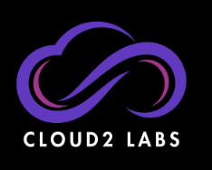
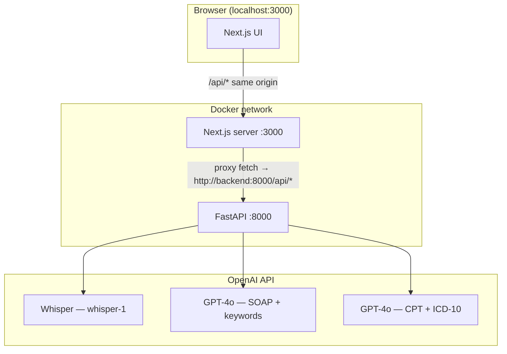

<p align="center">
  
</p>

# MediScript AI — AI-Powered Clinical Documentation

An AI-powered application that converts patient–doctor conversations into structured clinical documentation. Record audio or upload a file, and get a speaker-diarized transcript, AI-generated SOAP notes, keyword-highlighted medical terms, and on-demand billing code suggestions — all processed ephemerally with no patient data storage.

---

## Table of Contents

- [MediScript AI — AI-Powered Clinical Documentation](#mediscript-ai--ai-powered-clinical-documentation)
  - [Table of Contents](#table-of-contents)
  - [Project Overview](#project-overview)
  - [How It Works](#how-it-works)
  - [Architecture](#architecture)
    - [Architecture Diagram](#architecture-diagram)
    - [Architecture Components](#architecture-components)
    - [Typical Flow](#typical-flow)
  - [Get Started](#get-started)
    - [Prerequisites](#prerequisites)
      - [Verify Installation](#verify-installation)
    - [Quick Start (Docker)](#quick-start-docker)
    - [Local Development](#local-development)
  - [Project Structure](#project-structure)
  - [Usage Guide](#usage-guide)
  - [AI Pipeline Details](#ai-pipeline-details)
    - [Stage 1 — Speech-to-Text (Whisper)](#stage-1--speech-to-text-whisper)
    - [Stage 2 — Contextual Reasoning (GPT-4o)](#stage-2--contextual-reasoning-gpt-4o)
    - [Stage 3 — Billing Code Extraction (On-Demand)](#stage-3--billing-code-extraction-on-demand)
  - [Environment Variables](#environment-variables)
  - [Technology Stack](#technology-stack)
  - [Troubleshooting](#troubleshooting)
    - [Common Issues](#common-issues)
  - [License](#license)
  - [Disclaimer](#disclaimer)

---

## Project Overview

**MediScript AI** demonstrates how a two-stage generative AI pipeline — combining a speech-to-text model with a large language model — can convert raw clinical audio into structured, editable medical documentation.

Built as an open-source blueprint under the [Cloud2 Labs Innovation Hub](https://cloud2labs.com/innovation-hub/), MediScript AI is designed for:

- **Healthcare innovation demos** — show end-to-end AI clinical documentation in a browser with no infrastructure
- **Telemedicine platforms** — integrate into post-visit documentation workflows
- **Clinical scribing research** — evaluate LLM accuracy on SOAP note generation and medical entity extraction
- **Containerized deployments** — ship directly to any Innovation Hub environment via Docker

The application processes audio entirely in-memory. No patient audio, transcripts, or personally identifiable information is stored at any point.

---

## How It Works

1. The user records audio via the browser microphone or uploads an MP3/WAV file (up to 10 minutes).
2. The Next.js frontend sends the audio to `/api/process-audio` on the same origin; thin **Route Handlers** forward the request to the **FastAPI** backend using `BACKEND_INTERNAL_URL` at **request time** (so Docker runtime env works; rewrites alone would bake URLs in at build time).
3. The backend forwards the audio to **OpenAI Whisper** (`whisper-1`) with `verbose_json`, returning a timestamped array of transcript segments.
4. The segments are passed to **GPT-4o**, which determines which speaker is the Doctor and which is the Patient, generates a structured SOAP note, and extracts categorized medical keywords.
5. The frontend renders the diarized transcript with color-coded keyword highlights, and the formatted SOAP notes side by side.
6. Optionally, the doctor can click **Generate Billing Codes** to POST the SOAP notes to `/api/generate-billing`, which the Next.js server proxies to FastAPI; GPT-4o suggests CPT and ICD-10 codes.
7. The doctor can edit the AI-generated notes inline and export everything as TXT or Markdown.

---

## Architecture

MediScript AI is a **two-service** monorepo:

- **`frontend/`** — Next.js 16 (React) UI and static assets. It does not implement AI logic; same-origin `/api/*` **Route Handlers** proxy to FastAPI over HTTP using `BACKEND_INTERNAL_URL`.
- **`backend/`** — FastAPI (Python) service that preserves the original API routes, payloads, and OpenAI integration.

There is no database. All configuration for Docker runs is declared in **`docker-compose.yml`** (see comments there). Services talk to each other over the Compose network using the **backend service hostname** (`http://backend:8000`) from the Next.js server.

### Architecture Diagram



### Architecture Components

**Frontend (`frontend/`)**

- Dark-mode-first UI (Tailwind CSS, shadcn/ui)
- Audio recorder (`MediaRecorder`) with timer and 10-minute limit
- MP3/WAV upload
- Transcript with speaker labels and keyword highlighting
- SOAP notes with inline editing
- Billing code display and export (TXT / Markdown)

**Backend (`backend/`)**

- **`POST /api/process-audio`** — multipart audio (`audio` or `file`), Whisper + GPT-4o, same JSON shape as before
- **`POST /api/generate-billing`** — JSON body = SOAP notes object, GPT-4o billing JSON
- **`GET /health`** — liveness check

**Configuration**

- Browser API base: `NEXT_PUBLIC_API_BASE_URL` (empty = same-origin paths; recommended with the server proxy)
- Next.js → backend proxy: `BACKEND_INTERNAL_URL` on the server (use `http://backend:8000` in Compose)

### Typical Flow

1. User records or uploads audio in the browser.
2. Browser POSTs `FormData` to `/api/process-audio`.
3. Next.js forwards the request to FastAPI; Whisper returns segments; GPT-4o returns utterances, SOAP, keywords.
4. User optionally requests billing codes; browser POSTs JSON to `/api/generate-billing`; a Route Handler proxies to FastAPI.

---

## Get Started

### Prerequisites

- **Docker** — [Install Docker](https://docs.docker.com/get-docker/)
- **OpenAI API key** — [Get a key](https://platform.openai.com/api-keys)

For **local development without Docker**:

- Node.js 20+
- Python 3.12+
- npm

#### Verify Installation

```bash
node --version
npm --version
python3 --version
docker --version
```

---

### Quick Start (Docker)

From the repository root:

1. **Set your OpenAI API key** in the environment (not in `.env` files under `frontend/` or `backend/`):

   ```bash
   export OPENAI_API_KEY="sk-your-openai-api-key-here"
   ```

2. **Build and run both services** (all container env vars are defined in `docker-compose.yml`):

   ```bash
   docker compose up --build
   ```

3. Open **http://localhost:3000** (use the hostname `localhost` so the browser allows the microphone).

4. Stop:

   ```bash
   docker compose down
   ```

If you renamed services previously, remove old containers once:

```bash
docker compose down --remove-orphans
```

---

### Local Development

Run the **backend** and **frontend** in two terminals. Do not rely on `.env` files inside the service folders; export variables in your shell (or use your own tooling).

**Terminal 1 — FastAPI**

```bash
cd backend
python3 -m venv .venv
source .venv/bin/activate   # Windows: .venv\Scripts\activate
pip install -r requirements.txt
export OPENAI_API_KEY="sk-..."
export PORT=8000
./scripts/dev.sh
# or: uvicorn app.main:app --host 0.0.0.0 --port 8000 --reload
```

**Terminal 2 — Next.js**

```bash
cd frontend
npm install
export BACKEND_INTERNAL_URL="http://127.0.0.1:8000"
export NEXT_PUBLIC_API_BASE_URL=""
npm run dev
```

Production-style Next.js (after `npm run build`):

```bash
export BACKEND_INTERNAL_URL="http://127.0.0.1:8000"
npm run start
```

**Backend production-style script** (no reload):

```bash
cd backend && ./scripts/start.sh
```

---

## Project Structure

```
MediScriptAI/
├── backend/
│   ├── app/
│   │   ├── main.py              # FastAPI app + /health
│   │   ├── config.py            # os.environ helpers
│   │   ├── prompts.py           # System prompts (parity with original routes)
│   │   └── routers/
│   │       ├── process_audio.py
│   │       └── generate_billing.py
│   ├── scripts/
│   │   ├── dev.sh               # uvicorn --reload
│   │   └── start.sh             # uvicorn production
│   ├── Dockerfile
│   ├── requirements.txt
│   └── .dockerignore
├── frontend/
│   ├── app/                     # Next.js App Router (no API routes)
│   ├── components/
│   ├── lib/
│   │   ├── apiConfig.ts         # NEXT_PUBLIC_API_BASE_URL helper
│   │   └── utils.ts
│   ├── public/
│   ├── Dockerfile
│   ├── app/api/.../route.ts     # runtime proxy to FastAPI (BACKEND_INTERNAL_URL)
│   ├── next.config.ts           # standalone output
│   ├── package.json
│   └── tsconfig.json
├── docker-compose.yml             # Single source of container env (see file header)
├── .env.example                 # Hints for local shell exports only
└── README.md
```

---

## Usage Guide

**Recording a conversation**

1. Open the app at `http://localhost:3000`.
2. In the left panel, click **Start Recording** and grant microphone access.
3. Click **Stop Recording**, then **Process with AI**.

**Uploading an audio file**

1. Use the **Upload** tab, select MP3/WAV (up to ~10 minutes), then **Process with AI**.

**Reading the results**

- **Left:** diarized transcript with keyword highlights.
- **Right:** SOAP sections (Chief Complaint, Symptoms, Assessment, Recommendation).

**Editing SOAP notes**

1. Click the pencil icon on the SOAP card, edit, then **Save changes**.

**Generating billing codes**

1. Click **Generate Billing Codes (CPT & ICD-10)** below the SOAP card.

**Exporting**

- Copy, download TXT, or download Markdown from the export buttons.

---

## AI Pipeline Details

### Stage 1 — Speech-to-Text (Whisper)

The backend sends audio to `whisper-1` with `verbose_json` and uses the returned `segments` (text + start time).

### Stage 2 — Contextual Reasoning (GPT-4o)

Numbered segments are passed to `gpt-4o` with `response_format: json_object` to produce `utterances`, `soapNotes`, and `keywords`, matching the original application contract.

### Stage 3 — Billing Code Extraction (On-Demand)

The SOAP notes JSON is sent to `gpt-4o` with a medical-coder system prompt; the API returns `cpt` and `icd10` arrays.

---

## Environment Variables

**Docker:** Every variable injected into containers is listed and documented in **`docker-compose.yml`**. Set secrets in your shell before `docker compose up`, for example:

```bash
export OPENAI_API_KEY=sk-...
```

**Local dev:** Export the same logical variables in your shell (see `.env.example` for a short checklist). The app does not load `.env` files from inside `frontend/` or `backend/`.

| Variable | Service | Purpose |
|----------|---------|---------|
| `OPENAI_API_KEY` | backend | OpenAI API authentication |
| `OPENAI_WHISPER_MODEL` | backend | Whisper model (default `whisper-1`) |
| `OPENAI_CHAT_MODEL` | backend | Chat model (default `gpt-4o`) |
| `PORT` | both | Listen port inside container |
| `BACKEND_INTERNAL_URL` | frontend (Next server) | Base URL for proxying `/api/*` to FastAPI |
| `NEXT_PUBLIC_API_BASE_URL` | frontend | Optional browser API base; `""` = same-origin |
| `NODE_ENV`, `HOSTNAME`, `NEXT_TELEMETRY_DISABLED` | frontend | Standard Next.js / telemetry settings |

---

## Technology Stack

**Frontend**

- Next.js 16 (App Router), React 19, Tailwind CSS 4, shadcn/ui, Lucide

**Backend**

- FastAPI, Uvicorn, OpenAI Python SDK (Whisper + Chat Completions)

**Deployment**

- Multi-stage Dockerfiles for `frontend` and `backend`
- `docker compose up --build` from the repo root

---

## Troubleshooting

### Common Issues

**Microphone blocked**

- Use exactly `http://localhost:3000`, not `127.0.0.1` or a LAN IP.

**API errors / “Missing OPENAI_API_KEY”**

- Docker: ensure you exported `OPENAI_API_KEY` before `docker compose up`.
- Local: export it in both shells if needed; restart processes after changing env.

**Frontend cannot reach backend in Docker**

- Confirm `BACKEND_INTERNAL_URL` in `docker-compose.yml` is `http://backend:8000` (Compose DNS name).
- Confirm the backend container is healthy: `curl http://localhost:8000/health`

**Build failures**

- Frontend: `output: "standalone"` must remain in `frontend/next.config.ts`.
- Rebuild without cache: `docker compose build --no-cache`

---

## License

This project is licensed under our [LICENSE](./LICENSE.md) file for details.

---

## Disclaimer

**MediScript AI** is provided as-is for demonstration and educational purposes as part of the Cloud2 Labs Innovation Hub.

- This application is **not** a certified clinical documentation system and should **not** be used for medical decision-making.
- AI-generated SOAP notes, transcripts, and billing code suggestions must be reviewed by a qualified clinician or medical coder before use in any real patient care or billing context.
- No patient audio, transcripts, or personally identifiable information is stored by this application. However, audio data is transmitted to OpenAI's API for processing — review [OpenAI's data usage policies](https://openai.com/policies/api-data-usage-policies) before processing real patient conversations.
- CPT and ICD-10 code suggestions are illustrative only. Submitting incorrect billing codes carries significant compliance and legal risk. Do not use AI-generated codes without expert review.
